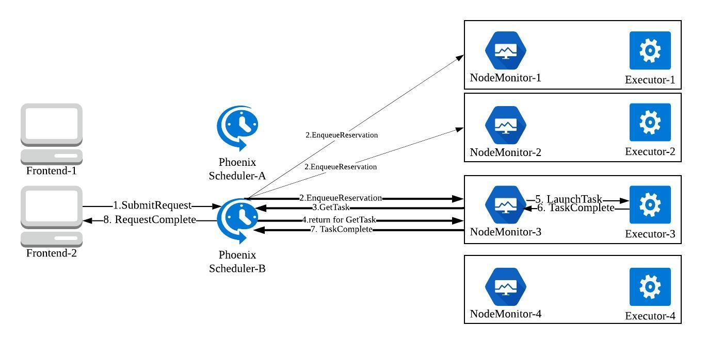

# Phoenix

Phoenix is a fault-tolerant distibuted low-latency scheduler based on [Sparrow](https://cs.stanford.edu/~matei/papers/2013/sosp_sparrow.pdf) implemented in Go. It uses [Zookeeper](https://github.com/apache/zookeeper) to implement group membership for worker nodes. Phoenix handles worker failures and recovers incomplete jobs, unlike Sparrow.

## Architecture
The architecture of Phoenix is largely similar to that of Sparrow. The main components are: Schedulers, Node Monitors, Executors and Frontends. The overview of the Phoenix scheduling environment and the scheduling workflow can be seen below:




## Prerequisites

1. Apache Zookeeper 
2. Zookeeper Go client: [https://github.com/samuel/go-zookeeper](https://github.com/samuel/go-zookeeper)
3. Go collections: [github.com/golang-collections/collections/queue](github.com/golang-collections/collections/queue)

## Running Phoenix

1. Start your Zookeeper cluster and add the cluster information to src/phoenix/zk.go.
```go
var ZkLocalServers = []string{"172.31.28.99:2181", "172.31.31.12:2181", "172.31.22.104:2181"}
```

2. Run `make` in the src/ directory
```bash
> make
go install ./...
```

3. Use `init-config` to generate the configuration file which contains the ip:port information about all components. By default, it will generate localhost addresses, but other ip addresses can also be provided to it.
```bash
> init-config
{
    "Schedulers": [
        "localhost:32943"
    ],
    "Monitors": [
        "localhost:32944",
        "localhost:32945"
    ],
    "Executors": [
        "localhost:33944",
        "localhost:33945",
    ]
}
```

4. Start all schedulers.
```bash
> init-scheduler -schedID i
```

5. Start all monitors.
```bash
> init-monitor -workerId i
```

6. Start all executors.
```bash
> init-executor -workerId i
```

7. Use `Frontend` defined in src/phoenix/frontend/frontend.go to submit jobs.

